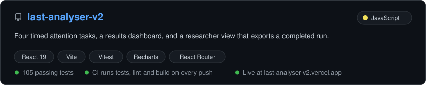
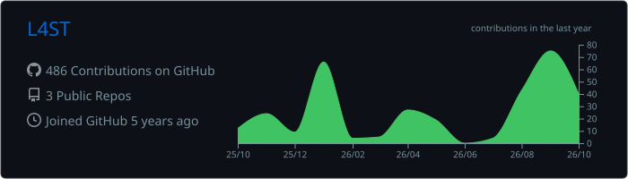
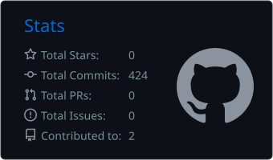
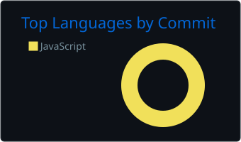

# L4ST

**Graduate software engineer working in React, JavaScript and TypeScript.**

I build web apps that run end to end: React components and state, the logic behind them, and the tests and CI that keep them working.

## Stack

Shipped in my public repos

Next to land in a public repo

## Selected work

[Live demo](https://last-analyser-v2.vercel.app) · [Source](https://github.com/LSQDR/last-analyser-v2)

## Activity

<!-- Add once the SUMMARY_GITHUB_TOKEN secret is set, since the built-in token cannot read contribution history:

-->

## Contact

